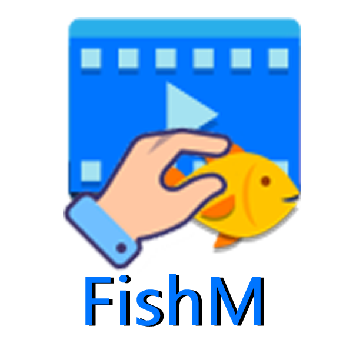

# FishM 浏览器

## 概述

FishM 是一款基于 **C#** 和 **.NET WebView2** 开发的轻量级浏览器，专为上班族设计。它提供了一个 **300x200像素** 的浏览窗口，支持自定义广告图片皮肤和快捷键操作，帮助用户在办公环境中正大光明地摸鱼，同时避免被老板发现。

---

## 主要功能

1. **基于 .NET WebView2**：
   - 使用现代浏览器内核，支持最新的网页技术和视频播放。
   - 轻量级，资源占用低，运行流畅。
2. **自定义广告图片皮肤**：
   - 用户可以根据办公环境自定义浏览器外观，使其看起来像是一个广告窗口。
3. **300x200像素浏览窗口**：
   - 小巧的窗口尺寸，便于隐藏在工作界面的角落，不易被察觉。
4. **隐身模式**：
   - 一键隐藏浏览器窗口，快速切换到工作界面，避免被老板发现。

---

## 安装与设置

1. **环境要求**：
   - Windows 10 或更高版本。
   - 安装 [[.NET 8.0]](https://dotnet.microsoft.com/zh-cn/download/dotnet/thank-you/runtime-desktop-8.0.11-windows-x64-installer?cid=getdotnetcore#:~:text=%E6%84%9F%E8%B0%A2%E4%B8%8B%E8%BD%BD-,.NET%208.0,-Desktop%20Runtime%20(v8.0.11))
2. **下载与安装**：
   - 访问[releases](https://github.com/Eoyz369/FishM/releases)，下载最新版本的安装包。
   - 运行安装包，按照提示完成安装。
3. **自定义皮肤**：
   - 打开 FishM 浏览器。
   - 点击视频窗口下的“立刻观看”按钮，上传自定义的广告图片或选择预设皮肤。
   - 调整窗口透明度，使其更符合办公环境。

---

## 使用技巧

1. **窗口布局**：
   - 将 FishM 浏览器窗口放置在屏幕的右下角，与其他工作窗口重叠，使其看起来像是一个广告弹窗。
2. **快速切换**：
   - 使用 `Alt + Q` 快捷键快速隐藏浏览器窗口，切换到工作界面，避免被老板发现。

---

## 常见问题

1. **浏览器窗口无法隐藏**：
   - 检查快捷键设置，确保 `Alt + Q` 已正确配置。
   - 重启浏览器，重新尝试隐藏窗口。

2. **自定义皮肤无法加载**：
   - 确保图片格式为 `*.jpg;*.jpeg;*.png;*.bmp;*.gif`。
   - 重新上传图片，或选择其他预设皮肤。

3. **快捷键失效**：
   - 检查是否有其他程序占用了相同的快捷键。
   - 重新配置快捷键，避免冲突。

---

## 更新日志
- **v1.5.2**：优化UI界面，修复已知bug。
- **v1.2.0**：修复已知bug。
- **v1.1.0**：新增隐身模式，修复已知bug。
- **v1.0.0**：初始版本发布，支持自定义皮肤、300x200像素窗口。

---

**FishM 浏览器**，让你在办公环境中轻松摸鱼，享受每一刻的休闲时光！
